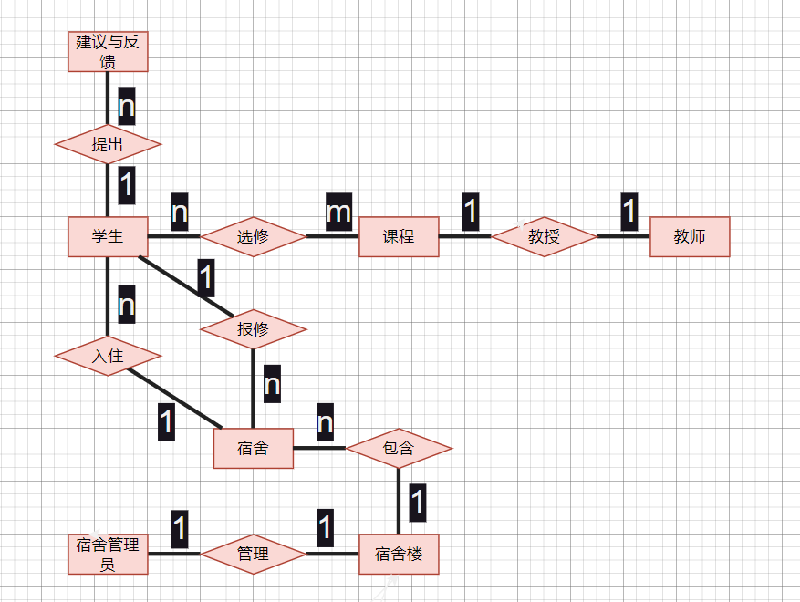

# HNU-SIMS

HNU - School Information Management System (2023Winter for a Course Project)

## 开发团队

- @[甘晴void](https://github.com/wolfvoid)
- @[Earnshawn](https://github.com/Earnshawnlpl)
- @[Anchor](https://github.com/Anchorom)
- @[Elaick]()
- @[Dragon]()
- @[SG]()

## 简介

本数据库大作业，是一个学生信息系统，可实现学生信息的管理。

本程序使用Java编写，使用eclipse进行开发，数据库使用MySQL数据库搭配Navicat进行数据管理，程序使用JDBC技术进行数据库连接，使用JavaSwing开发图形化界面，整个系统界面美观、功能丰富。本系统点击首页的“更换外观”按钮可切换不同风格的外观，系统分为4个模式，学生模式、教师模式、宿管模式和系统管理员模式，分别面向学生、教师、宿管和系统管理员，不同的模式有不同的功能。

本系统功能完善且丰富(增加了将系统内的各种信息导出为excel文件的功能)，程序检错能力强，界面简洁。由于时间有限，代码可能有冗余。

在编写时有参考github开源项目，感谢前辈。



## 运行教程

### 连接数据库

```
1. 将/lib/school_system.sql数据库文件导入MySQL数据库。

2. 使用Eclipse / IntelliJ IDEA导入项目。

3. 修改HomePage类的databaseConnection方法，将数据库名、用户名和密码等修改为自己的信息，即可运行，并进入欢迎界面。

```


### 登陆

```
1. 点击“学生登录”并输入账号“20192019101”和密码“12345678”登入学生模式。

2. 或者点击“宿管登录”并输入账号“1001”和密码“123456”登入宿管模式。

3. 或者点击“管理员登录”并输入账号“admin”和密码“admin”登入系统管理模式，在此可添加学生和宿管等。

```


### 学生端

```
1. 点击“个人信息”，查看个人信息。

2. 点击“选课”，进入“全部”页面，显示全部可选课程；

    点击某行课程右边的“选课”，可以选修某门课程。

    点击上方的”导出“，可以将记录表导出为excel；

    点击”查询“，进入“查询”页面并分别输入课程号，课程名，教师名，点击"查询"。

3.点击”我的课程"，查看个人课程信息。

    点击上方的”导出“，可以将记录表导出为excel；

4.点击“宿舍报修”，进入页面分别输入楼号，楼层，宿舍号，报修详细，点击”提交“即可申请宿舍报修。

5.点击“宿舍反馈”，进入页面输入建议与反馈，点击“提交“即可提交宿舍反馈。

6.点击”修改密码“，进入页面输入旧密码，新密码，确认密码，点击”提交“即可修改密码。

7.点击”退出“退出学生端。
```


### 教师端

```
1. 点击“个人信息”，查看个人信息。

2. 点击“任教课程”，查看任教课程。

3. 点击“成绩登记”，进入页面并点击某行选课记录右边的“登记”,可以登记成绩。

4. 点击”修改密码“，进入页面输入旧密码，新密码，确认密码，点击”提交“即可修改密码。

5. 点击”退出“退出教师端。
```


### 宿管端

```
1.点击“个人信息”，查看个人信息。

2.点击“宿舍管理”，进入“全部”页面，显示全部宿舍信息；

	点击某行宿舍右边的“查看”，可以查看某个宿舍的宿舍信息；

	点击上方的”添加“,可以向表中添加某条宿舍信息;

	点击上方的”导出“，可以将记录表导出为excel；

	点击“查询”，进入"查询"页面并输入楼层，宿舍号等信息，点击”查询“即可。

3.点击“住宿管理”，进入“全部”页面，显示全部住宿信息；

	点击某行记录右边的“查看”，可以查看某条住宿信息；

	点击上方的”添加“，可以向表中添加某条住宿信息；

	点击上方的”导出“，可以将记录表导出为excel；

	点击“查询”，进入"查询"页面并输入学号，姓名等信息，点击”查询“即可。

4.点击“出入登记”，进入“全部”页面，显示全部出入信息；

	点击某行记录右边的“查看”，可以查看某条出入信息；

	点击上方的”添加“，可以向表中添加某条出入信息；

	点击上方的”导出“，可以将记录表导出为excel；

	点击“查询”，进入"查询"页面并输入学号，姓名等信息，点击”查询“即可。

5.点击“宿舍报修”，显示全部报修信息；

	点击行记录右边的“查看”，可以查看某条报修信息；

	点击上方的”导出“，可以将记录表导出为excel。

6.点击“建议与反馈”，显示全部建议信息；

	点击某行记录右边的“查看”，可以查看某条建议信息；

	点击上方的”导出“，可以将记录表导出为excel。

7.点击”修改密码“，进入页面输入旧密码，新密码，确认密码，点击”提交“即可修改密码。

8.点击”退出“退出宿管端。
```


### 管理员端

```
1.点击“学生管理”，进入“全部”页面，显示全部学生信息；

	点击某行宿舍右边的“查看”，可以查看某个学生的信息；

	点击上方的”添加“,可以向表中添加某个学生信息;

	点击上方的”导出“，可以将记录表导出为excel；

	点击“查询”，进入"查询"页面并输入学号，密码等信息，点击下方”查询“即可。

2.点击“教师管理”，进入“全部”页面，显示全部教师信息；

	点击行记录右边的“查看”，可以查看某个教师的信息；

	点击上方的”添加“，可以向表中添加某个教师的信息；

	点击上方的”导出“，可以将记录表导出为excel；

	点击“查询”，进入"查询"页面并输入工号、姓名等信息，点击下方”查询“即可。

3.点击“课程管理”，进入“全部”页面，显示全部课程信息；

	点击行记录右边的“查看”，可以查看某个课程的信息；

	点击上方的”添加“，可以向表中添加某个课程的信息；

	点击上方的导出“，可以将记录表导出为excel；

	点击“查询”，进入"查询"页面并输入课程编号、课程名等信息，点击下方”查询“即可。

4.点击“选课管理”，进入“全部”页面，显示全部学生选课信息；
	
	点击行记录右边的“退选”，可以帮助某学生退选选课信息；

	点击上方的”导出“，可以将记录表导出为excel；

5.点击“宿管管理”，进入“全部”页面，显示全部宿管信息；

	点击行记录右边的“查看”，可以查看某个宿管的信息；

	点击上方的”添加“，可以向表中添加某个宿管的信息；

	点击上方的”导出“，可以将记录表导出为excel；

	点击“查询”，进入"查询"页面并输入编号，密码等信息，点击下方”查询“即可。

6.点击“宿舍管理”，进入“全部”页面，显示全部宿舍信息；

	点击行记录右边的“查看”，可以查看某个宿舍的信息；

	点击上方的”添加“，可以向表中添加某个宿舍的信息；

	点击上方的”导出“，可以将记录表导出为excel；

	点击“查询”，进入"查询"页面并输入楼号，楼层等信息，点击下方”查询“即可。

7.点击”宿舍楼管理“，进入“全部”页面，显示全部宿舍楼信息；

	点击行记录右边的“查看”，可以查看某个宿舍楼的信息；

	点击上方的”添加“，可以向表中添加某个宿舍楼的信息；

	点击上方的”导出“，可以将记录表导出为excel；

	点击“查询”，进入"查询"页面并输入楼号，层数等信息，点击下方”查询“即可。

8.点击”住宿管理“，进入“全部”页面，显示全部学生住宿信息；

	点击行记录右边的“查看”，可以查看某个学生住宿的信息；

	点击上方的”添加“，可以向表中添加某个学生住宿的信息；

	点击上方的”导出“，可以将记录表导出为excel；

	点击“查询”，进入"查询"页面并输入学号，姓名等信息，点击下方”查询“即可。

9.点击“寝室分配”，进入页面，点击”一键自动分配“，即可自动分配宿舍；

	点击"一件重新分配"，即可自动重新分配宿舍。

10.点击'删库跑路'，进入页面并输入密码，即可删除系统数据库。

11.点击”退出“退出管理员端。
```

